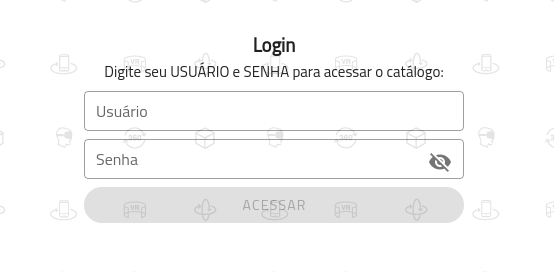
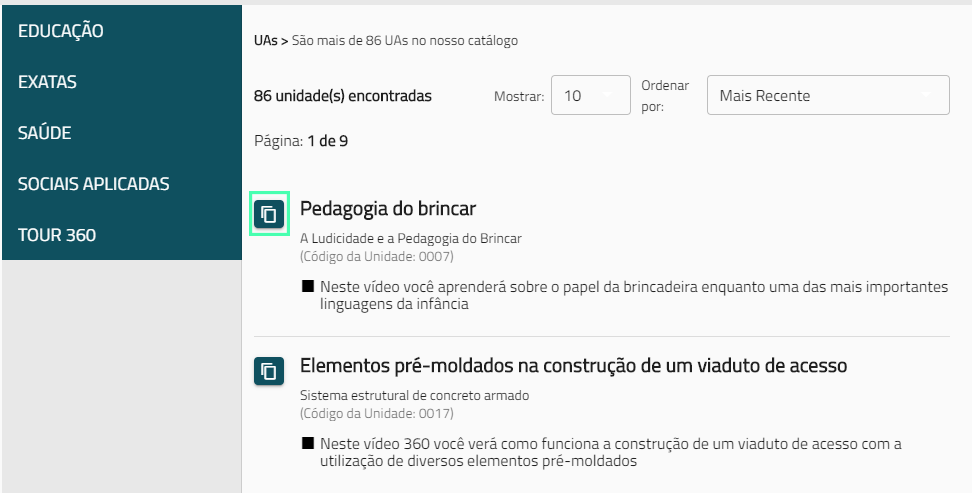
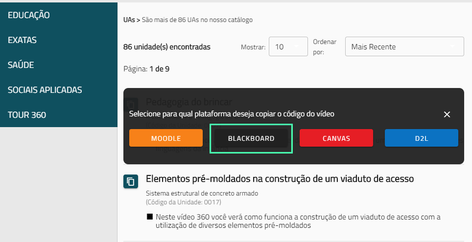

> Este guia é primariamente destinado à **professores e coordenadores de instituições de ensino**.

## Um Catálogo de Experiências Imersivas!

O [Catálogo Ambia](https://catalogo.imersys.com/) é um catalogo completo de experiências de vídeos do Ambia 360, simuladores de laboratórios com o Ambia Labs e elementos interativos do Ambia 3D. Destinado a professores e coordenadores de cursos que desejam pesquisar experiências imersivas a serem utilizadas em suas aulas e Unidades de Aprendizagem.

### Efetuando o login

Para acessar o catálogo é necessário uma conta com usuário e senha **fornecida pela sua instituição de ensino**.

Se você já possui o usuário e a senha, prossiga efetuando o login. Caso contrário, entre em contato com sua instituição - possivelmente ela já obteve este código previamente junto à Imersys.

### Utilizando o Catálogo

Utilize a barra lateral do **Catálogo** para filtrar pelas grandes áreas ou então a barra de pesquisa superior para pesquisar textualmente por vídeos, laboratórios ou elementos interativos. Após encontrar a experiência desejada, clique no ícone lateral como mostrado na imagem abaixo.

Ao clicar no ícone, um menu será aberto e você irá clicar no botão que se refere a seu **LMS** para copiar o código da experiência.

