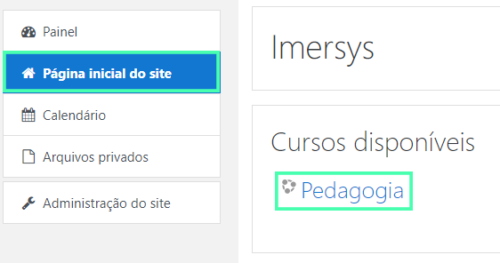
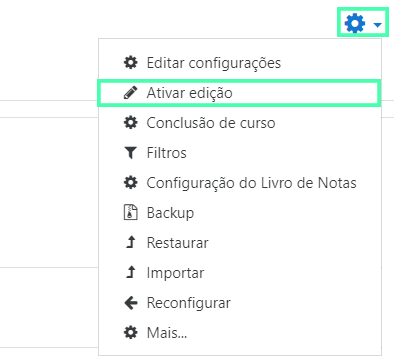
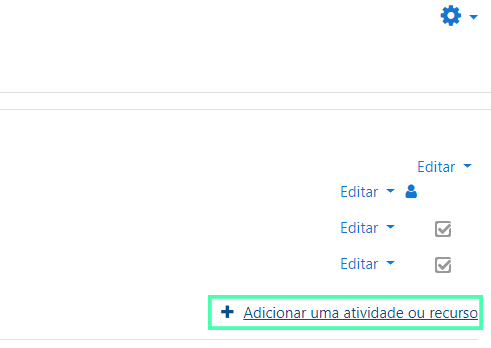
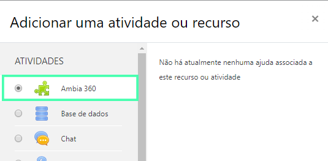
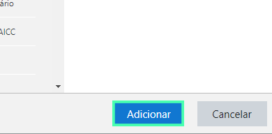
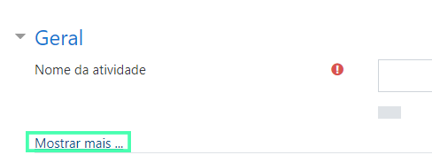
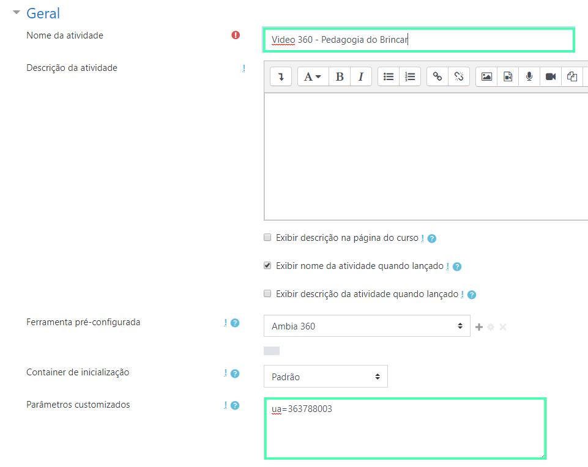

[moodle]: ./moodle.md
[catalogo]: ./index.md

> Este guia tem o objetivo de auxiliar a utilização de *experiências imersivas* do **Ambia** na plataforma **Moodle**. O guia é primariamente destinado à **professores e coordenadores de instituições de ensino**.

## Requisitos Técnicos

O primeiro passo para adicionar *experiências imersivas* do Ambia -- i.e. **Unidades de Aprendizagem ("UA")**, **vídeos 360**, **3D interativos**, **dentre outras** -- é garantir que a [instalação do **Ambia**][moodle] foi realizada corretamente no Moodle em sua instituição de ensino. Caso a instalação não tenha sido feita, peça auxílio ao administrador do sistema de sua instituição para que a faça antes de prosseguir neste guia.

## Guia para adicionar UAs, vídeos 360 e 3D interativos

### 1º Passo: Selecionando um curso no Moodle

Como primeiro passo para adicionar uma *experiência imersiva*, selecione a opção **Página inicial do site** no menu lateral e então selecione algum curso para adicionar o **Ambia**.

No exemplo da imagem utilizamos o curso "Pedagogia", mas a princípio você pode utilizar *qualquer* curso.

Na sequência, dentro do curso selecionado procure o ícone de engrenagem à direita da página e selecione a opção **Ativar edição**.

Com o modo de edição habilitado, ainda à direita da página selecione a opção **Adicionar uma atividade ou recurso**.

Dentro do pop-up de **Adicionar uma atividade ou recurso** selecione a ferramenta **Ambia** e selecione **Adicionar**.

-----------------------------------

Na página seguinte, selecione a opção **Mostrar mais**.

### 2º Passo: Copiando o código da experiência do Catálogo

O próximo passo para adicionar uma *experiência imersiva* no Moodle necessita que você tenha acesso ao [Catálogo](https://catalogo.imersys.com/), abrindo o site numa *nova aba* para escolher o item que deseja adicionar ao Moodle.

Se você já possui conta no [Catálogo](https://catalogo.imersys.com/), faça login normalmente e pule para o 3º passo. Caso contrário, guiaremos você em como [utilizar o Catálogo][catalogo].

### 3º Passo: Adicionando ao Moodle

Agora é necessário preencher as informações coletadas no **Catálogo** ao Moodle para adicionar a *experiência imersiva*.

Preencha o nome e, no campo **Parâmetros customizados** coloque o parâmetro que foi copiado do **Catálogo**.

Pronto! Uma *experiência imersiva* da coleção do **Ambia** foi adicionada com sucesso. Para assistir e interagir com a UA, o vídeo 360 ou o 3D interativo agora, vá até a página do curso em que foi adicionado e selecione o título da experiência.

>Se a *experiência imersiva* não carregou é possível que você tenha errado algum passo durante a [instalação][moodle] ou talvez na hora de adicionar o item. Caso necessário, realize a instalação e configuração novamente.
