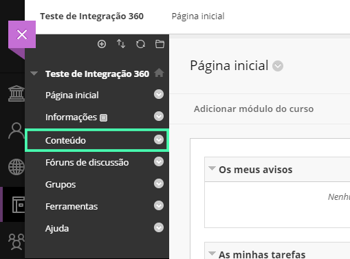

> Este guia tem o objetivo de auxiliar a utilização do **Ambia 360** na plataforma **Blackboard Learn**. O guia é primariamente destinado à **professores e coordenadores de instituições de ensino**.

## Requisitos

O primeiro passo para conseguir adicionar vídeos Ambia 360 para a sua plataforma Blackboard é garantir que a instalação
da *ferramenta Ambia 360* foi feita corretamente no seu ambiente, caso a instalação não tenha sido feita, peça
auxílio do administrador da sua plataforma Blackboard para que a realize e teste.

Se sua ferramenta já foi instalada e testada, prossiga o tutorial para adicionar vídeos 360 para seus alunos.

## Adicionando um vídeo 360 ao Blackboard

Como primeiro passo para adicionar um vídeo, selecione a opção **Cursos** no menu lateral e então selecione algum curso para adicionar à ferramenta.

>No caso aqui utilizamos o curso **Teste de Integração 360**, mas a princípio você pode usar *qualquer* curso para testar
>a ferramenta

Depois, selecione no menu lateral a opção **Conteúdo**.

Após isso, no seletor **Criar Conteúdo** localizado no menu superior, selecione a opção **Criar Link da Web**.

## Copiando o código do vídeo no Ambia Catálogo

O próximo passo para adicionar o vídeo ao seu ambiente Blackboard necessita que você tenha acesso ao *Ambia Catálogo* e abra ele numa *nova aba* para escolher qual dos nossos vídeos 360 você deseja adicionar ao Blackboard, se você já possui conta no site do catálogo faça login normalmente e pule ao próximo passo, se não, ensinsamos você nos próximos passos a criar uma conta.

### Criando uma conta

Lembrando que para criar uma conta é necessário que a sua instituição seja uma de nossas *parceiras* e possua um *Código da instituição*. Se você já possui o código em mãos prossiga com a criação de sua conta, se não entre em contato com sua instituição de ensino para se tornar um de nossos parceiros!

>Para criar sua conta preencha todos os campos que estão presentes na imagem abaixo, lembrando de adicionar o Código da instituição correto.

### Utilizando o Catálogo Ambia

O Nosso Catálogo Ambia possui uma usabilidade muito simples, utilize a barra lateral para filtrar por grandes Áreas ou a barra de pesquisa superior para pesquisar um vídeo específico. Após encontrar o vídeo desejado, clique no ícone lateral como mostrado na imagem abaixo para abrir o menu de copiar o código.

Após clicar no ícone um menu será aberto e você só precisa clicar no botão que se refere ao *Blackboard* para copiar o código.

>Após clicar no botão Blackboard será exibida a seguida mensagem "Código Copiado!", mostrando que o código foi copiado com sucesso

### Retornando ao Blackboard

Agora é necessário preencher as informações para adicionar o vídeo, adicione um **Nome**
ao seu vídeo e depois adicione a **URL** dele. A **URL** será uma composição do **Domínio do provedor** e código do vídeo. Exemplo: **https://lms.imersys.com/?ua=363681335**

Por último, nas **Opções de link da web**, marque **Não** para a opção de Abrir link em uma nova janela.

Pronto! Um vídeo da coleção do **Ambia 360** foi adicionado com sucesso. Para assistir e interagir com o vídeo agora, vá até a página do curso em que foi adicionado e selecione o título do vídeo.

>Se o vídeo não carregou é possível que você tenha errado algum passo durante a [instalação](#guia-de-instalacao) ou talvez na hora de adicionar o vídeo. Caso necessário, realize a instalação e configuração novamente.