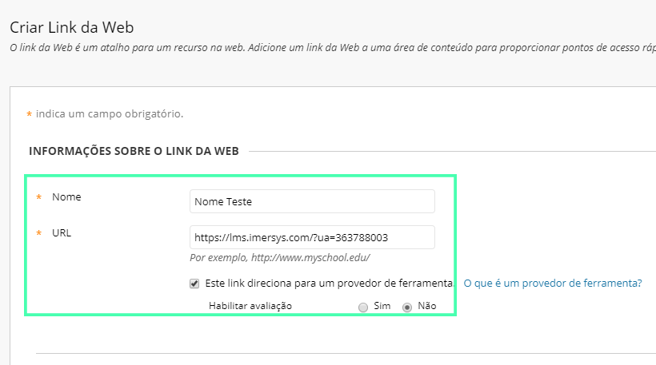
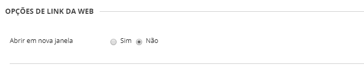

[blackboard]: ./index.md
[catalogo]: ./catalogo.md

> Este guia tem o objetivo de auxiliar a utilização do **Ambia 360** na plataforma **Blackboard Learn**. O guia é primariamente destinado à **professores e coordenadores de instituições de ensino**.

## Requisitos Técnicos

O primeiro passo para adicionar vídeos do **Ambia 360** é garantir que a [instalação do **Ambia 360**][blackboard] foi realizada corretamente no Blackboard em sua instituição de ensino. Caso a instalação não tenha sido feita, peça auxílio ao administrador do sistema de sua instituição para que a faça antes de prosseguir neste guia.

## Guia para adicionar vídeos

### 1º Passo: Selecionando um curso no Blackboard

Como primeiro passo para adicionar um vídeo, selecione a opção **Cursos** no menu lateral e então selecione algum curso para adicionar o **Ambia 360**.

No exemplo da imagem utilizamos o curso "Teste de Integração 360", mas a princípio você pode utilizar *qualquer* curso.

Na sequência, selecione no menu lateral a opção **Conteúdo**.

Após isso, no seletor **Criar conteúdo** localizado no menu superior, selecione a opção **Criar Link da Web**.

### 2º Passo: Copiando o código do vídeo no Catálogo

O próximo passo para adicionar vídeos no Blackboard necessita que você tenha acesso ao [Catálogo](https://catalogo.imersys.com/), abrindo o site numa *nova aba* para escolher nossos vídeos você deseja adicionar ao Blackboard.

Se você já possui conta no [Catálogo](https://catalogo.imersys.com/), faça login normalmente e pule para o 3º passo. Caso contrário, guiaremos você em como [utilizar o Catálogo][catalogo].

### 3º Passo: Adicionando ao Blackboard

Agora é necessário preencher as informações coletadas no **Catálogo** ao Blackboard para adicionar o vídeo.

Adicione um **Nome** ao seu vídeo e depois adicione a **URL** dele. A **URL** será uma composição do **Domínio do provedor** e código do vídeo. Exemplo: **https://lms.imersys.com/?ua=363681335**

Por fim, nas **Opções de link da web**, marque **Não** para a opção de Abrir link em uma nova janela.

Pronto! Um vídeo da coleção do **Ambia 360** foi adicionado com sucesso. Para assistir e interagir com o vídeo agora, vá até a página do curso em que foi adicionado e selecione o título do vídeo.

>Se o vídeo não carregou é possível que você tenha errado algum passo durante a [instalação][blackboard] ou talvez na hora de adicionar o vídeo. Caso necessário, realize a instalação e configuração novamente.
