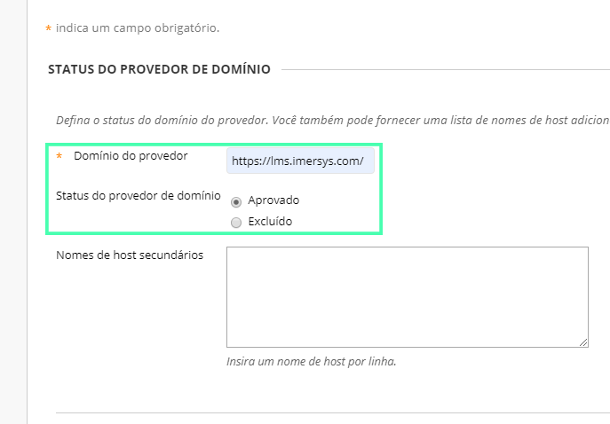
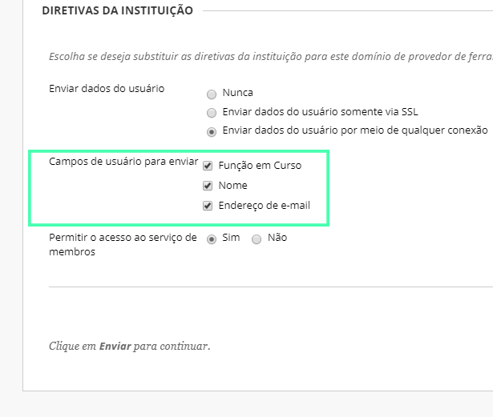

Esse guia tem como objetivo auxiliar na instalação do **Ambia 360** na plataforma **Blackboard Learn**. Esse guia é primariamente destinado à **administradores de sistemas**.

## Requisitos Técnicos

A seguir são listados os requisitos técnicos necessários para realizar a instalação do **Ambia 360**:

1. Um **ambiente Blackboard Learn** configurado com acesso de **administrador**
2. O **Domínio do provedor** (fornecido pela Imersys por e-mail)
3. A **Chave do provedor** (fornecida pela Imersys por e-mail)
4. O **Segredo do provedor** (fornecida pela Imersys por e-mail)

> A **Chave do provedor** e a **Segredo do provedor** são de uso exclusivo de sua instituição. Portanto, se você pretende utilizar mais de uma instalação, solicite à Imersys novas chaves.
>

## Guia de Instalação

### 1º Passo: Acessando a área de Administração

Se sua instituição satifaz todos os requisitos técnicos da seção anterior, o primeiro passo para iniciar a instalação da ferramenta é ir até a área do **Administrador**.

> Se você não tem acesso à essa área, peça ao administrador do Blackboard Learn de sua instituição para que instale esta ferramenta para você ou peça para que ele lhe conceda acesso.

### 2º Passo: Encontrando o local de instalação

Dentro da seção **Integrações** selecione a opção **Provedores de ferramenta de LTI**.

Depois selecione na barra superior a opção **Registrar domínio do provedor**.

### 3º Passo: Configurando a ferramenta

Agora vamos preencher as informações necessárias e configurações para instalar a ferramenta. Esteja bem atento às informações presentes nas imagens para ter certeza que tudo irá funcionar corretamente.

Você irá utilizar os dados fornecidos pela Imersys para preencher o campo **Domínio do provedor**. Também será necessário selecionar a opção **Aprovado** no **Status do provedor de domínio**.

Na seção de **Configuração padrão** selecione a opção **Definir globalmente** e nos 
campos abaixo insira as chaves que foram fornecidas pra você pela Imersys.

Na opção **Campos de usuário para enviar** é importante deixar selecionadas todas as opções

Em seguida clique em **Enviar** e pronto! Se você seguiu todos os passos corretamente sua
ferramenta **Ambia 360** foi instalada com sucesso. Se algo deu errado revise a [instalação](#guia-de-instalacao) para ver se nenhum erro foi cometido.

## Testando a Ferramenta

Após finalizar todos os procedimentos anteriores, recomendamos que seja realizado um teste. Para testar a ferramenta, selecione a opção **Cursos** no menu lateral e então selecione algum curso para adicionar à ferramenta.

>No caso aqui utilizamos o curso **Teste de Integração 360**, mas a princípio você pode usar *qualquer* curso para testar
>a ferramenta

Depois, selecione no menu lateral a opção **Conteúdo**.

Após isso, no seletor **Criar Conteúdo** localizado no menu superior, selecione a opção **Criar Link da Web**.

Agora é necessário preencher as informações para adicionar o vídeo, adicione um **Nome**
ao seu vídeo e depois adicione a **URL** dele. A **URL** será uma composição do **Domínio do provedor** e código do vídeo. Exemplo: **https://lms.imersys.com/?ua=363681335**

Por último, nas **Opções de link da web**, marque **Não** para a opção de Abrir link em uma nova janela.

Pronto! Um vídeo da coleção do **Ambia 360** foi adicionado com sucesso. Para assistir e interagir com o vídeo agora, vá até a página do curso em que foi adicionado e selecione o título do vídeo.

>Se o vídeo não carregou é possível que você tenha errado algum passo durante a [instalação](#guia-de-instalacao) ou talvez na hora de adicionar o vídeo. Caso necessário, realize a instalação e configuração novamente.
