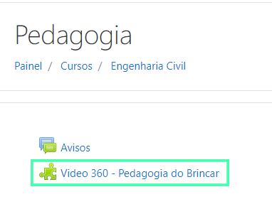

Para instalar nossa **Ferramenta Externa Ambia 360** você irá precisar de:

1. Um ambiente moodle configurado
2. Um link fornecido pela Imersys
3. Uma chave de segredo fornecida pela Imersys
4. Uma chave do consumidor, também fornecida pela Imersys

Se você já possui todas essas coisas, o primeiro passo para iniciar a instalação da ferramenta é ir até a área de **Administração do site**. 

> Se você não tem acesso à essa área, peça ao administrador do moodle para que 
> instale a ferramenta para você ou peça para que ele lhe conceda acesso.

<!--toc-->

## Encontrando o local de instalação

Dentro da área de Administração do site na plataforma moodle, selecione a aba **Plugins** e procure a opção **Gerenciar Ferramentas**.

 Dentro da página de Gerenciar Ferramentas clique na opção: **Configurar uma ferramenta manualmente**.

## Preenchendo as informações para instalação

Agora dentro da página de Configurar Ferramenta, além de preencher o nome
de sua escolha para a ferramenta, você irá precisar de alguns
dados fornecidos por **nós** da **Imersys**. São eles:
 1. URL da ferramenta
 2. Chave do Consumidor
 3. Segredo Compartilhado

E na caixa **Uso da configuração de ferramenta**, selecione a opção: **Mostrar no seletor de atividades como uma ferramenta pré-configurada**.

> Nós recomendamos que o nome Ambia 360 seja mantido durante a instalação
> para facilitar o acesso e uso da ferramenta.

## Testando a Ferramenta

Para testar a ferramenta volte à **Página inicial do site** e selecione algum dos cursos disponíveis, para esse guia utilizaremos o curso de Pedagogia.

Dentro do curso selecionado procure o ícone de engrenagem à direita da página e selecione a opção **Ativar edição**.

Com o modo de edição habilitado, ainda à direita da página selecione a opção **Adicionar uma atividade ou recurso**.

Dentro do pop-up de Adicionar uma atividade ou recurso selecione a ferramenta **Ambia 360** e clique em **Adicionar**.

-----------------------------------

>Se você não encontrou a opção **Ambia 360** pode ser que tenha feito algum erro no processo de instalação da ferramenta
ou tenha adicionado um nome diferente para ela.

Na página seguinte, clique na opção **Mostrar mais**.

Após isso preencha o nome do vídeo e, no campo **Parâmetros Customizados** coloque o seguinte parâmetro: **ua=363788003**.

>O parâmetro deve carregar o seguinte vídeo: **Pedagogia do brincar**.

E pronto! seu vídeo foi adicionado. Para assistir o vídeo vá até a página do curso em que foi adicionado e clique no título do vídeo.

>Se o vídeo não carregou é possível que você tenha errado algum passo na **instalação** ou na hora de **adicionar o vídeo**.
> Se necessário realize a instalação e configuração novamente.