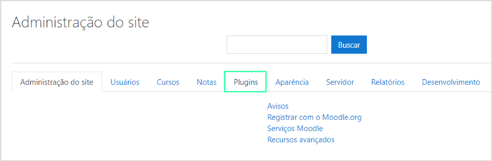
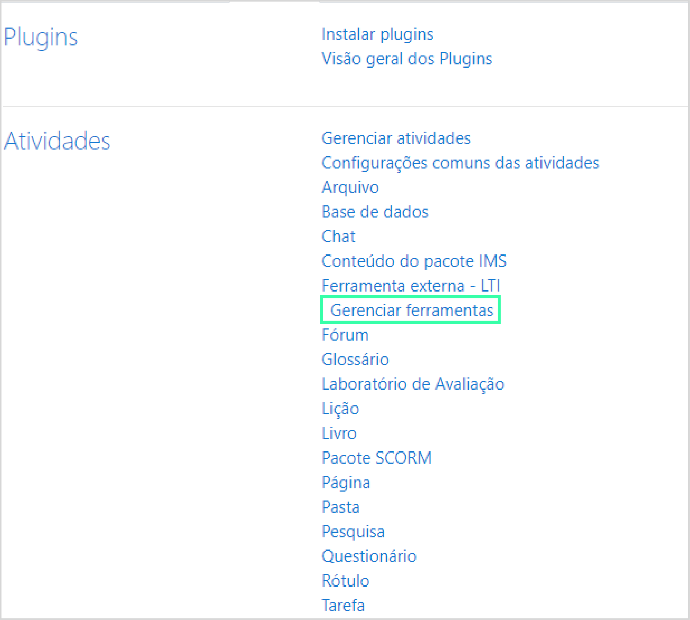
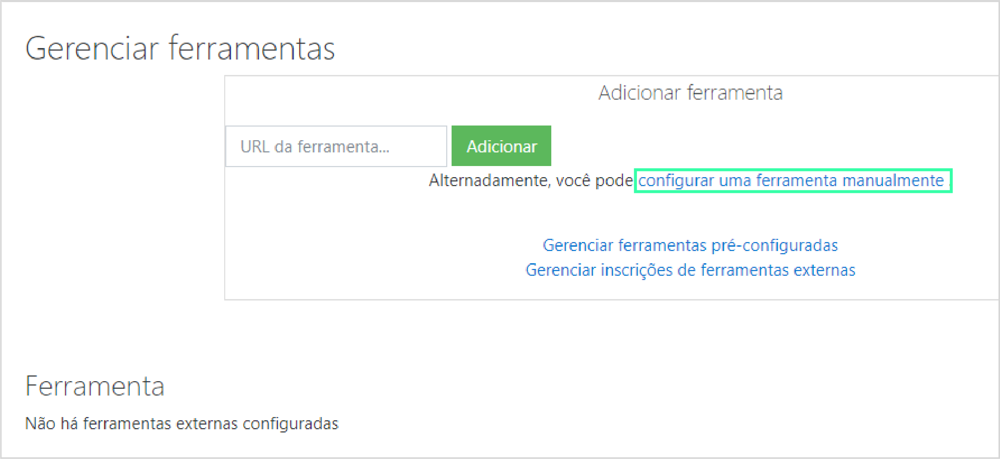
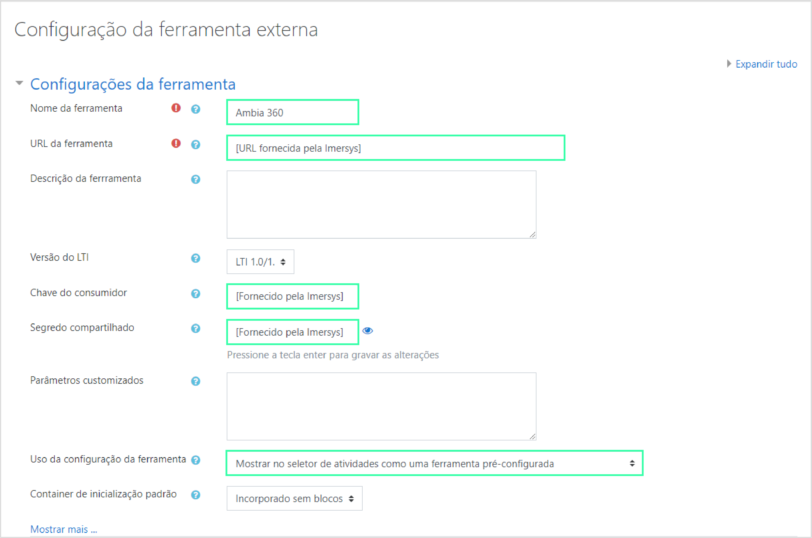
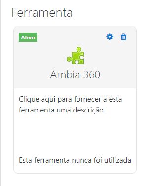

Para instalar nossa **Ferramenta Externa Ambia 360** é necessário já possuir
quatro coisas: 

1. Um ambiente moodle configurado
2. Um link fornecido pela Imersys
3. Uma chave de segredo fornecida pela Imersys
4. Uma chave do consumidor, também fornecida pela Imersys

Se você já possui todas essas coisas, para iniciar a instalação da ferramenta 
externa o primeiro passo é ir até a área de **Administração do site**. 

> Se você não tem acesso à essa área, peça ao administrador do moodle para que 
> instale a ferramenta para você ou peça para que ele lhe conceda acesso.

<!--toc-->

## Achando o local de instalação

Dentro da área de Administração do site na plataforma moodle, selecione a aba
que trata de **Plugins**

Após clicar na aba de Plugins procure a opção **Gerenciar Ferramentas**

 Dentro da página de Gerenciar Ferramentas clique na opção: **Configurar uma ferramenta manualmente**

 

## Preenchendo as informações para instalação

Agora dentro da página de Configurar Ferramenta, além de preencher o nome
de sua escolha para a ferramenta, você irá precisar de alguns
dados fornecidos por **nós** da **Imersys**. São eles:
 1. URL da ferramenta
 2. Chave do Consumidor
 3. Segredo Compartilhado

E na caixa **Uso da configuração de ferramenta**, selecione a opção: **Mostrar no seletor de atividades como uma ferramenta pré-configurada**

> Nós recomendamos que o nome Ambia 360 seja mantido durante a instalação
> para facilitar o acesso e uso da ferramenta.

## Testando a Ferramenta

Se a ferramenta foi configurada corretamente, após a tela de configuração você deve 
ter a ferramenta já configurada e o status dela como Ativo. Se ela não apareceu é por que
algo foi configurado de maneira errada, volte no passo-a-passo e tente refazer.

Para testar se a ferramenta funcionou corretamente adicione uma atividade como 
docente, usando o seguinte código como parâmetro: **"video=357624974"**
