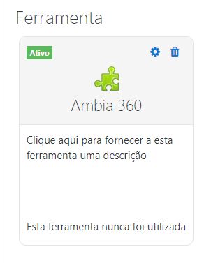
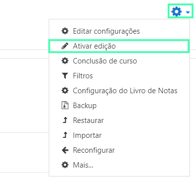
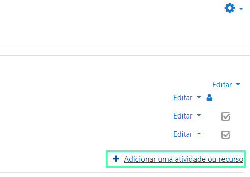
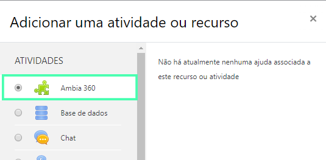
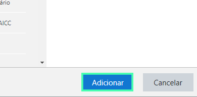
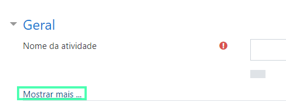
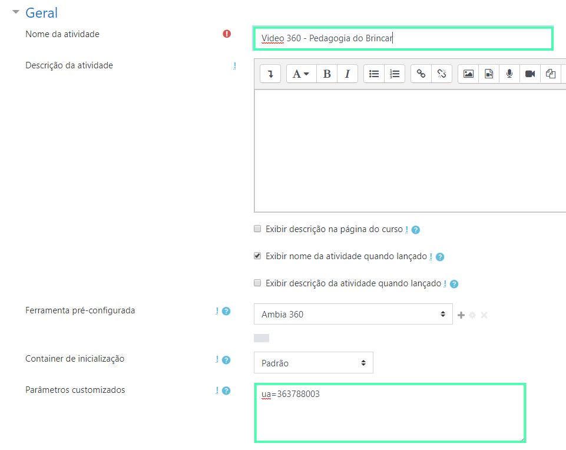

Esse guia tem como objetivo auxiliar na instalação do **Ambia 360** na plataforma **Moodle**.

## Requisitos Técnicos

A seguir são listados os requisitos técnicos necessários para realizar a instalação:

1. Um **ambiente Moodle configurado** com acesso de **administrador**
2. A **URL da ferramenta** (fornecido pela Imersys por e-mail)
3. A **Chave do consumidor** (fornecida pela Imersys por e-mail)
4. O **Segredo compartilhado** (fornecida pela Imersys por e-mail)

> A **Chave do consumidor** e a **Chave de segredo** são de uso exclusivo. Portanto, se você pretende utilizar mais de uma instalação, solicite à Imersys novas chaves.
>

## Guia de Instalação

### 1º Passo: Acessando a área de Administração

Se sua IES satifaz todos os requisitos técnicos da seção anterior, o primeiro passo para iniciar a instalação da ferramenta é ir até a área de **Administração do site**.

> Se você não tem acesso à essa área, peça ao administrador do Moodle  de sua IES para que instale esta ferramenta para você ou peça para que ele lhe conceda acesso.

<!--toc-->

### 2º Passo: Encontrando o local de instalação

Dentro da área de **Administração do site** na plataforma Moodle, selecione a aba **Plugins** e na seção de **Atividades** a opção **Gerenciar ferramentas**.

 Dentro da página de **Gerenciar ferramentas** selecione a opção **Configurar uma ferramenta manualmente**.

### 3º Passo: Preenchendo as informações

Agora dentro da página de **Configurações da ferramenta**, além de preencher "Ambia 360" como o nome para a ferramenta, você irá utilizar os dados fornecidos pela Imersys para preencher os campos da **URL da ferramenta**, **Chave do consumidor** e **Segredo compartilhado**.

Feito isso, na caixa **Uso da configuração de ferramenta**, selecione a opção **Mostrar no seletor de atividades como uma ferramenta pré-configurada**.

> Nós recomendamos que o nome "Ambia 360" seja utilizado durante a instalação para facilitar o acesso e uso da ferramenta.

## Testando a Ferramenta

Para testar a ferramenta volte à **Página inicial do site** e selecione algum dos cursos disponíveis, para esse guia utilizaremos o curso de Pedagogia.

Dentro do curso selecionado procure o ícone de engrenagem à direita da página e selecione a opção **Ativar edição**.

Com o modo de edição habilitado, ainda à direita da página selecione a opção **Adicionar uma atividade ou recurso**.

Dentro do pop-up de **Adicionar uma atividade ou recurso** selecione a ferramenta **Ambia 360** e selecione **Adicionar**.

-----------------------------------

Na página seguinte, selecione a opção **Mostrar mais**.

Após isso preencha o nome do vídeo e, no campo **Parâmetros customizados** coloque o parâmetro "ua=363788003".

>O parâmetro "ua=363788003" irá carregar o vídeo "Pedagogia do brincar".

Pronto! Um vídeo da coleção do **Ambia 360** foi adicionado com sucesso. Para assistir e interagir com o vídeo agora, vá até a página do curso em que foi adicionado e selecione o título do vídeo.

>Se o vídeo não carregou é possível que você tenha errado algum passo durante a [instalação](#guia-de-instalacao) ou talvez na hora de adicionar o vídeo. Caso necessário, realize a instalação e configuração novamente.
