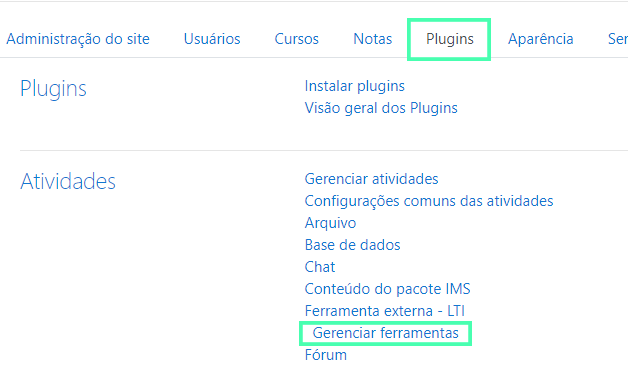

> Este guia tem o objetivo de auxiliar a instalação do **Ambia 360** na plataforma **Moodle**. O guia é primariamente destinado à **administradores de sistemas**.

## Requisitos Técnicos

A seguir são listados os requisitos técnicos necessários para realizar a instalação  do **Ambia 360**:

1. Um **ambiente Moodle** configurado com acesso de **administrador**
2. A **URL da ferramenta** (fornecido pela Imersys por e-mail)
3. A **Chave do consumidor** (fornecida pela Imersys por e-mail)
4. O **Segredo compartilhado** (fornecida pela Imersys por e-mail)

> A **Chave do consumidor** e a **Chave de segredo** são de uso exclusivo de sua instituição. Portanto, se você pretende utilizar mais de uma instalação, solicite à Imersys novas chaves.
>

## Guia de Instalação

### 1º Passo: Acessando a área de Administração

Se sua instituição satifaz todos os requisitos técnicos da seção anterior, o primeiro passo para iniciar a instalação da ferramenta é ir até a área de **Administração do site**.

> Se você não tem acesso à essa área, peça ao administrador do Moodle  de sua instituição para que instale esta ferramenta para você ou peça para que ele lhe conceda acesso.

<!--toc-->

### 2º Passo: Encontrando o local de instalação

Dentro da área de **Administração do site** na plataforma Moodle, selecione a aba **Plugins** e na seção de **Atividades** a opção **Gerenciar ferramentas**.

 Dentro da página de **Gerenciar ferramentas** selecione a opção **Configurar uma ferramenta manualmente**.

### 3º Passo: Configurando a ferramenta

Agora dentro da página de **Configurações da ferramenta**, além de preencher "Ambia 360" como o nome para a ferramenta, você irá utilizar os dados fornecidos pela Imersys para preencher os campos da **URL da ferramenta**, **Chave do consumidor** e **Segredo compartilhado**.

Feito isso, na caixa **Uso da configuração de ferramenta**, selecione a opção **Mostrar no seletor de atividades como uma ferramenta pré-configurada**.

> Nós recomendamos que o nome "Ambia 360" seja utilizado durante a instalação para facilitar o acesso e uso da ferramenta.

## Testando a Instalação

[moodle-usage]: ./moodle-usage.md

Após finalizar todos os procedimentos do [Guia de Instalação](#guia-de-instalacao), recomendamos que faça um teste [adicionando vídeos do **Ambia 360** no seu Moodle][moodle-usage].
