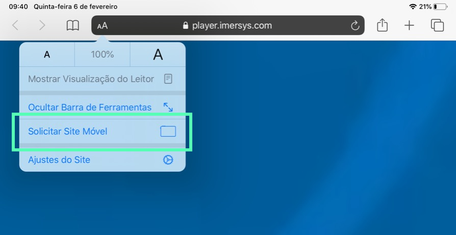

O Ime Player é o tocador de vídeos na Web da Imersys. Com o Ime Player você
assiste vídeos em 360 graus e conteúdo de realidade virtual **usando headsets**
ou **dispositivos tradicionais**.

<!--toc-->

<!-- LEMBRAR EM ALGUM LUGAR DE LIMPAR A CACHE -->

## Usando headset

É recomendado utilizar um headset de realidade virtual (ex. [óculos de realidade virtual](https://pt.wikipedia.org/wiki/Head-mounted_display))
para para uma maior imersão e também maior conforto durante a visualização de vídeos longos.

### Oculus Quest

| Navegador  | Versão suportada                      |
|------------|---------------------------------------|
| Oculus Browser  | Em breve                         |

### Oculus Go & Gear VR

| Navegador  | Versão suportada                      |
|------------|---------------------------------------|
| Oculus Browser  | Em breve                         |

## Usando dispositivos tradicionais

<!-- Algo sobre giroscopio: Caso seu dispositivo tenha sensores de giroscópio -->

### PC & laptop (Windows e Linux)

| Navegador  | Versão suportada                      |
|------------|---------------------------------------|
| Chrome     | 79+                                   |
| Edge       | Em breve                              |

### Android

| Navegador  | Versão suportada   | Funciona com [Cardboard](https://pt.wikipedia.org/wiki/Google_Cardboard) |
|------------|--------------------|------------------------|
| Firefox **(recomendado)**   | 68+                |         Sim            |
| Chrome     | 79+                |         Em breve       |

### iPhone (iOS 13.3+)

| Navegador  | Versão suportada                      | Funciona com [Cardboard](https://pt.wikipedia.org/wiki/Google_Cardboard) |
|------------|---------------------------------------|---------|
| Safari **(recomendado)**    | 13                   |   Sim   |
| Chrome     | 79             |   Sim                          |

### iPad (iPad OS)

| Navegador  | Versão suportada                      |
|------------|---------------------------------------|
| Safari     | 13, com a opção de `Site Móvel` (ver explicação abaixo)                   |

No iPad, o navegador Safari utiliza por padrão a versão desktop para visualizar as páginas, o que impossibilita alguns recursos mobile interessantes do Ime Player (como o acesso ao giroscópio do dispositivo, por exemplo). Portanto, o usuário deverá `Solicitar Site Móvel` no Safari ao clicar no botão `aA` da barra de URL de modo que utilize todos os recursos do Ime Player:

