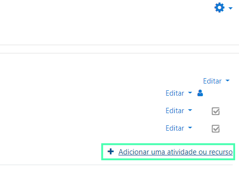
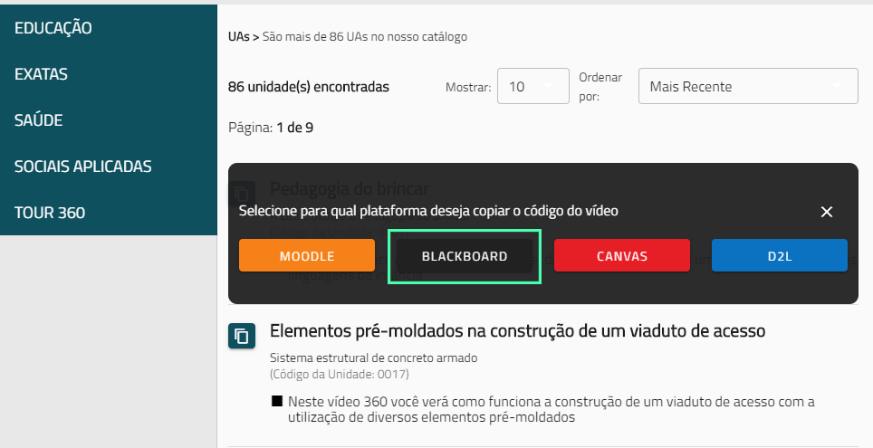
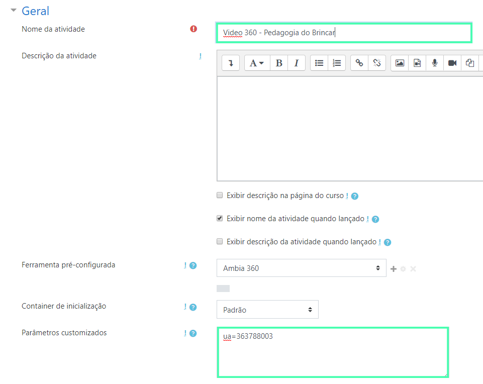

O primeiro passo para conseguir adicionar vídeos Ambia 360 para a sua plataforma Moodle é garantir que a instalação
da *ferramenta Ambia 360* foi feita corretamente no seu ambiente, caso a instalação não tenha sido feita, peça
auxílio do administrador da sua plataforma Moodle para que a realize e teste.

Se sua ferramenta já foi instalada e testada, prossiga o tutorial para adicionar vídeos 360 para seus alunos.

## Adicionando um vídeo 360 ao Moodle

Para adicionar um vídeo 360 o primerio passo é ir até a **Página inicial do site** e selecionar algum dos cursos disponíveis. Para esse guia utilizaremos o curso de Pedagogia como exemplo, mas você pode usar qual curso preferir e tiver cadastrado em seu ambiente.

Dentro do curso selecionado procure o ícone de engrenagem à direita da página e selecione a opção **Ativar edição**.

Com o modo de edição habilitado, ainda à direita da página selecione a opção **Adicionar uma atividade ou recurso**.

Dentro do pop-up de **Adicionar uma atividade ou recurso** selecione a ferramenta **Ambia 360** e selecione **Adicionar**.

-----------------------------------

Na página seguinte, selecione a opção **Mostrar mais**.

## Copiando o código do vídeo no Ambia Catálogo

O próximo passo para adicionar o vídeo ao seu ambiente Moodle necessita que você tenha acesso ao *Ambia Catálogo* e abra ele numa *nova aba* para escolher qual dos nossos vídeos 360 você deseja adicionar ao Moodle, se você já possui conta no site do catálogo faça login normalmente e pule ao próximo passo, se não, ensinsamos você nos próximos passos a criar uma conta.

### Criando uma conta

Lembrando que para criar uma conta é necessário que a sua instituição seja uma de nossas *parceiras* e possua um *Código da instituição*. Se você já possui o código em mãos prossiga com a criação de sua conta, se não entre em contato com sua instituição de ensino para se tornar um de nossos parceiros!

>Para criar sua conta preencha todos os campos que estão presentes na imagem abaixo, lembrando de adicionar o Código da instituição correto.

### Utilizando o Catálogo Ambia

O Nosso Catálogo Ambia possui uma usabilidade muito simples, utilize a barra lateral para filtrar por grandes Áreas ou a barra de pesquisa superior para pesquisar um vídeo específico. Após encontrar o vídeo desejado, clique no ícone lateral como mostrado na imagem abaixo para abrir o menu de copiar o código.

Após clicar no ícone um menu será aberto e você só precisa clicar no botão que se refere ao *Moodle* para copiar o código.

>Após clicar no botão Moodle será exibida a seguida mensagem "Código Copiado!", mostrando que o código foi copiado com sucesso

### Retornando ao Moodle

Após isso preencha o nome do vídeo e, no campo **Parâmetros customizados** coloque o parâmetro que foi copiado do Catálogo Ambia.

>O parâmetro "ua=363788003" irá carregar o vídeo "Pedagogia do brincar".

Pronto! Um vídeo da coleção do **Ambia 360** foi adicionado com sucesso. Para assistir e interagir com o vídeo agora, vá até a página do curso em que foi adicionado e selecione o título do vídeo.

>Se o vídeo não carregou é possível que você tenha errado algum passo durante a [instalação](#guia-de-instalacao) ou talvez na hora de adicionar o vídeo. Caso necessário, realize a instalação e configuração novamente.